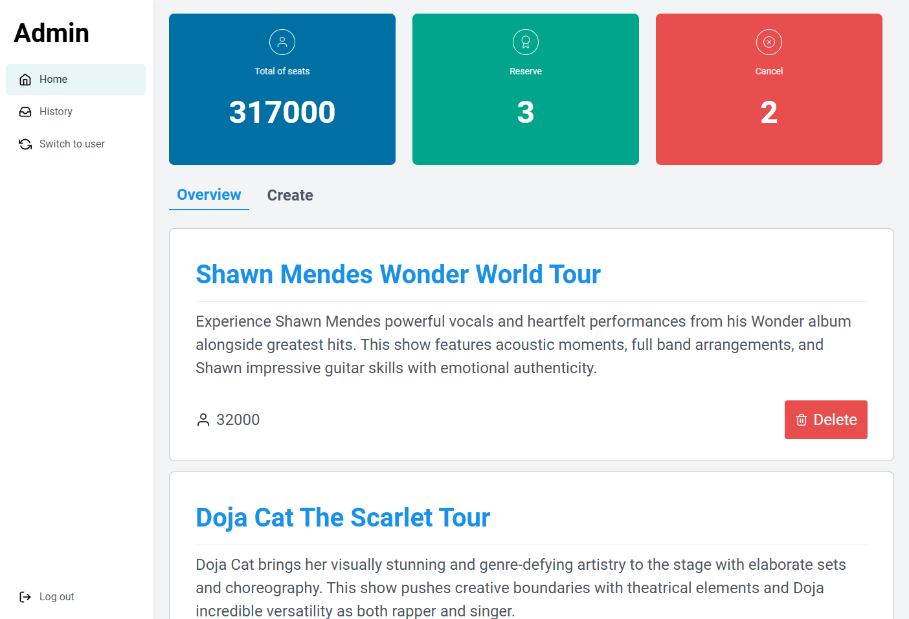

# Seat Master

This repository contains a seat reservation application split into two main parts:

- `client/` — Next.js (React) frontend
- `server/` — NestJS backend (REST API), using PostgreSQL via the `pg` driver

This README explains how to run the project locally, the high-level architecture, libraries used, and how to run tests.

## Quick summary

- Frontend: Next.js (App Router) + React 19, TypeScript, Tailwind CSS (configured under `client/`)
- Backend: NestJS + TypeScript. The server connects to PostgreSQL using a `DATABASE_URL` environment variable (see `server/src/lib/database`).
- The frontend calls the backend API; the default backend URL is `http://localhost:5000` and can be overridden with `NEXT_PUBLIC_BACKEND_URL`.

## Demo



## Where files live

- `client/` — Next.js app and frontend source (Next dev server typically runs on port 3000)
- `server/` — NestJS API and backend code (default port 5000)

## Prerequisites

- Node.js >= 18
- npm (or yarn/pnpm)
- PostgreSQL (or a compatible DB) accessible via a connection string for `DATABASE_URL`

## Local setup (Windows PowerShell)

1. Clone and open the project

```powershell
git clone <your-repo-url>
```

2. Set environment variables

- Server: create `server/.env` or export environment variables in your shell

```
DATABASE_URL=postgres://<user>:<password>@<host>:<port>/<database>
PORT=5000   # optional (defaults to 5000)
```

- Client: optionally set `client/.env.local` to override backend URL

```
NEXT_PUBLIC_BACKEND_URL=http://localhost:5000
```

3. Install dependencies

```powershell
cd .\client
npm install

# In another terminal
cd ..\server
npm install
```

4. Run in development mode (two terminals)

```powershell
# Terminal A: backend (NestJS watch mode)
cd .\server
npm run start:dev

# Terminal B: frontend (Next.js)
cd .\client
npm run dev
```

When both are running:

- Frontend: http://localhost:3000
- Backend: http://localhost:5000

5. Build for production

```powershell
# Build and start client (Next)
cd .\client
npm run build
npm run start

# Build and start server (NestJS)
cd ..\server
npm run build
npm run start:prod
```

## Architecture overview

- The project separates presentation (frontend) from API and persistence (backend).
- Backend uses NestJS modular structure — controllers and modules are organized under `src/api/` (e.g. `admin`, `users`). A global `DatabaseModule` in `server/src/lib/database` creates a single `pg.Pool` used by the app.
- Frontend uses Next.js App Router (`client/src/app`) with React Context and custom hooks (e.g. `reserveContext.tsx`, `useBooking.ts`) to manage client state and call backend APIs.
- The server reads DB configuration from `process.env.DATABASE_URL` and creates a connection pool (see `server/src/lib/database/database.service.ts`).
- CORS is enabled for `http://localhost:3000` (see `server/src/main.ts`).

## Important libraries and their roles

- Frontend (`client/package.json`):

  - `next` — Next.js framework (routing, SSR/SSG)
  - `react`, `react-dom` — UI library
  - `axios` — HTTP client used in parts of the frontend
  - `react-icons` — icon library
  - `tailwindcss` — utility-first CSS framework (configured via PostCSS)

- Backend (`server/package.json`):

  - `@nestjs/*` — NestJS framework (DI, controllers, modules)
  - `pg` — PostgreSQL client driver (connection pool)
  - `@nestjs/config` — configuration/environment helper (dotenv is invoked in `main.ts`)

- Dev / testing / tooling:
  - `jest`, `ts-jest`, `supertest` — testing tools configured for the backend
  - `eslint`, `prettier` — linting and formatting
  - `typescript` — static typing

## Useful npm scripts (from package.json)

- Client (`client/package.json`)

  - `npm run dev` — start Next.js development server
  - `npm run build` — build Next app
  - `npm run start` — start Next in production
  - `npm run lint` — run ESLint

- Server (`server/package.json`)
  - `npm run start:dev` — NestJS dev/watch mode
  - `npm run build` — compile NestJS to `dist/`
  - `npm run start:prod` — run compiled server (`node dist/main`)
  - `npm run test` — run Jest unit tests
  - `npm run test:e2e` — run e2e tests (uses `test/jest-e2e.json`)

## Running tests

- Backend

```powershell
cd .\server
npm run test          # run unit tests
npm run test:watch    # run tests in watch mode
npm run test:e2e      # run e2e tests
```

## Troubleshooting

- If you see "Database connection fail" in server logs, confirm `DATABASE_URL` is valid and the database allows connections from your machine.
- If ports conflict, change `PORT` for the server or set the `PORT` env for Next.js.
- Use Node 18+ (project dependencies and TypeScript assume a modern Node runtime).

## Suggested next steps

- Add a `client/.env.example` and `server/.env.example` documenting required env variables
- Add a simple frontend test setup and `npm run test` script for `client/` (Vitest or Jest)
- Add a GitHub Actions workflow to run lint/test/build on PRs

## Bonus Task

- Expressyour opinion about how to optimize your website in case that this
  website contains intensive data and when more people access, the lower speed
  you get?
  Ans:1.Implement cursor-based pagination (page size: 10) 2.Add database indexing on frequently queried columns. 3.Consider load balancing for high traffic.

- Expressyour opinion about how to handle when many users want to reserve the
  ticket at the same time? We want to ensure that in the concerts there is no one
  that needs to stand up during the show.
  Ans: Queue System:

Implement message queue (Redis Queue, RabbitMQ, Bull) for reservation requests
Process reservations sequentially to prevent race conditions
Add timeout for payment (e.g., 10 minutes hold)

Example: In online shopping, when 1000 customers try to buy 100
limited items simultaneously, the queue processes each request
sequentially to prevent overselling. Unpaid reservations are
auto-released after 10 minutes.
